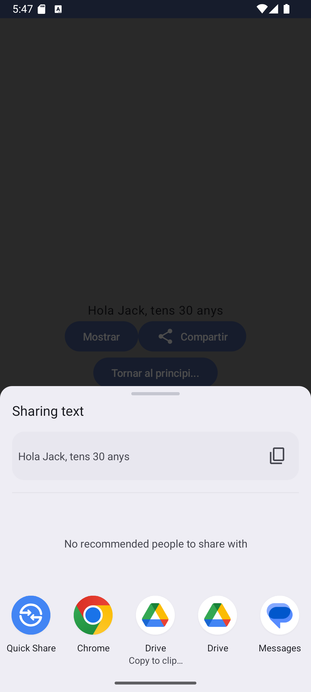

# Android App with screen navigation
## Android Studio Version
Android Studio Ladybug | 2024.2.1 Patch 2

## Language
Kotlin with JetPack Compose

## Purpose
Show an **screen navigation** use case

---

# Gradle dependencies
It is necessary to add the following dependencies in the file [`app/build.gradle.kts`](app/build.gradle.kts):

``` bash
dependencies {
  implementation 'androidx.navigation:navigation-compose:2.7.5'
}
```

# Screenshot

